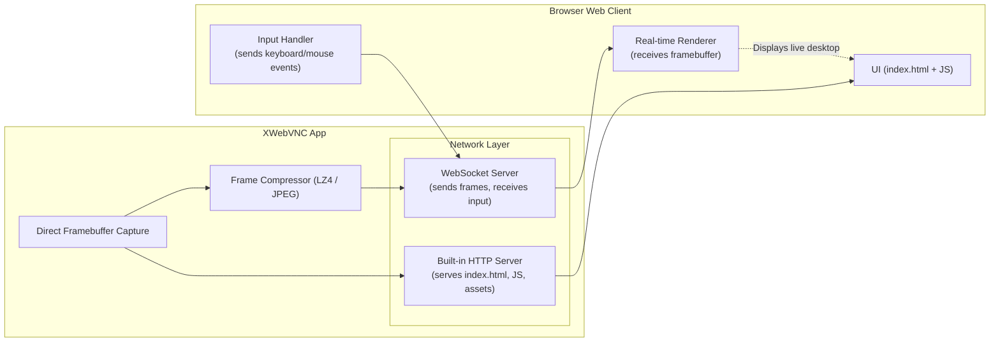

# 🖥️ XWebVNC Server

**XWebVNC** is an efficient, headless **Xorg/Xvfb-based display server** with built-in **WebVNC** capability — allowing you to stream and interact with your Linux desktop directly from any modern web browser.

---

## 🚀 Features

- 🧠 **Headless X Server** — Works as either **Xorg** or **Xvfb**, optimized for headless environments.
- 🌐 **Built-in WebSocket & HTTP Server** — Serves both the web client and live framebuffer updates.
- ⚡ **Real-Time Compression** — Supports:
  - **LZ4** → Ultra-fast, low-latency compression
  - **JPEG** → High compression ratio with good visual fidelity
- 🪶 **Zero External Dependencies** — No x11vnc, no nginx, no proxies.
- 🔒 **Lightweight & Secure** — Ideal for servers, embedded systems, or containerized setups.
- 🧩 **Fully Self-Contained** — Includes built-in `index.html` client page.
- 🖱️**local mouse** -> use local mouse like few good webvnc app

---

## 🧪 Example Use Cases
- Remote GUI access for headless Linux servers
- Browser-based desktops in Docker or VMs
- Lightweight remote development environments
- Embedded Linux systems with browser-based control

# 💽 Run Released Binary
1 Download Xvfb or Xorg
  - Get the binary from the releases page for your platform (x86 or ARM).
  - Xvfb is recommended.

2 Run Xvfb or Xorg
  - Start Xvfb or Xorg as you normally would.
  - By default, WebVNC listens on port 5000.
  - You can change the port using the -web PORT option.

3 Example Command
```./Xvfb :1 -screen 0 1280x720x24 -web 80```

4 Xorg Notes
  > - Detailed Documentation for *Xorg* usage is not yet available. Please use Xvfb if you face any issue with Xorg setup.
  > - It will be updated soon.


# 🛠️ build and run from source code
example command `meson compile -C build && ./build/hw/vfb/Xvfb :1 -screen 0 1280x720x24 -web 80`
> more details will be added soon

## 🧩 Architecture




# 📷 Screen Shots
---


